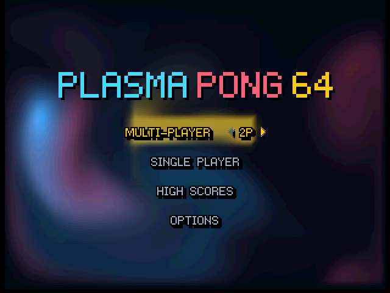
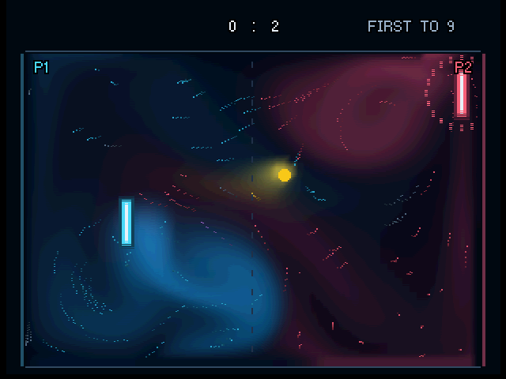
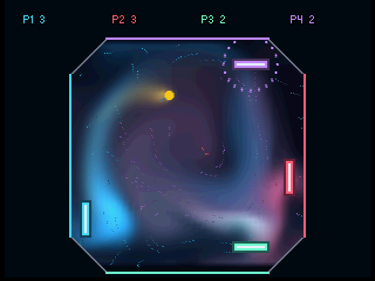

# Plasma Pong 64

Pong for Nintendo 64, played inside a real-time fluid simulation.
Inspired by [Plasma Pong](https://en.wikipedia.org/wiki/Plasma_Pong) by Steve Taylor.

- **Fluid physics:** stir colourful currents that carry dye and push the ball.
- **Paddle powers:** fire jets, suck in the ball, and charge a powerful release.
- **Multiplayer:** 2-4 player local matches.
- **Endless arcade:** face an increasingly challenging AI and save your high scores.
- **Visuals:** seven flow effects, with low & high-resolution modes.
- **Rumble Pak:** support for the N64's rumble pak!

Download **plasmapong.z64** from the [latest release](https://github.com/acheronfail/plasmapong64/releases/latest).

## Screenshots

