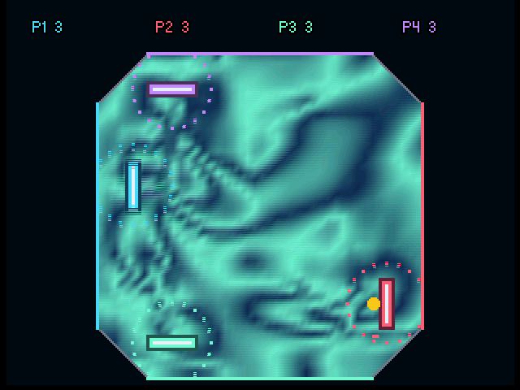
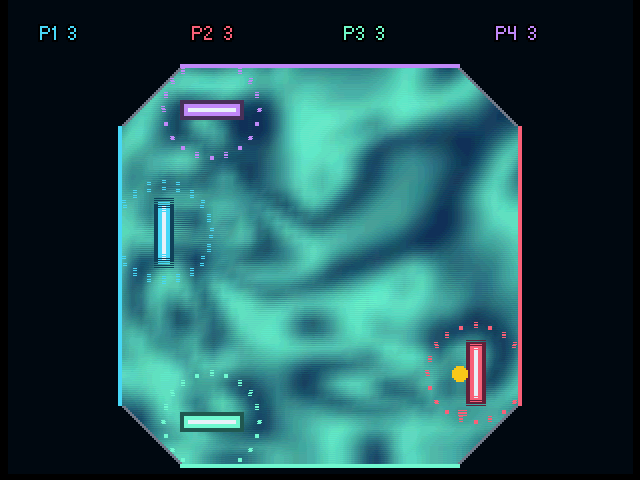
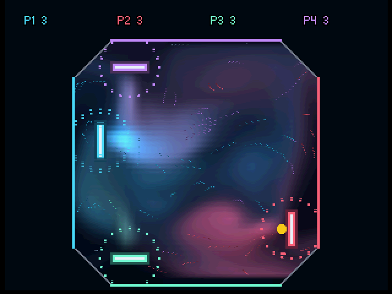
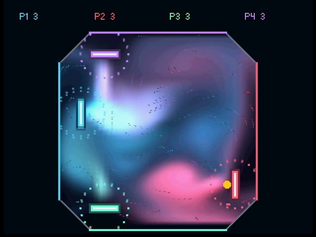
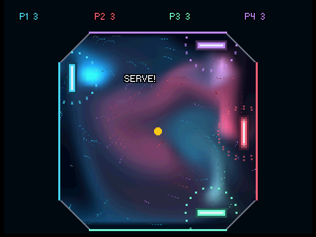
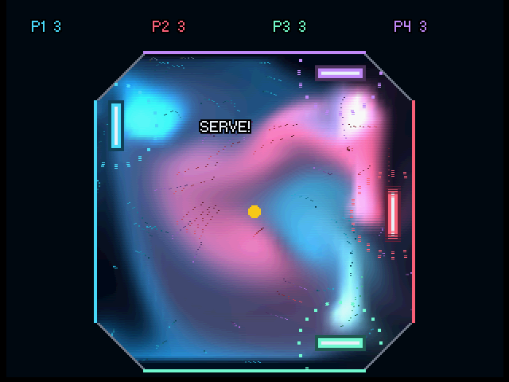
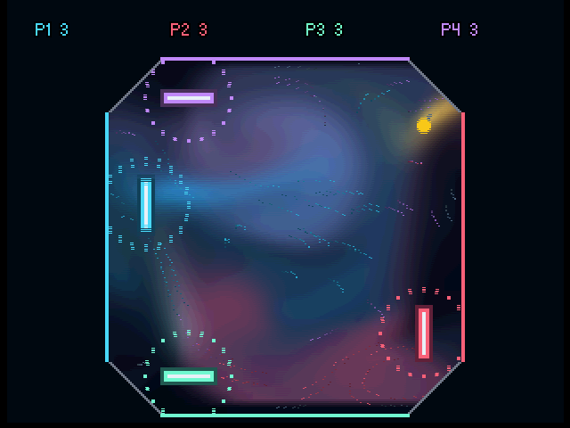
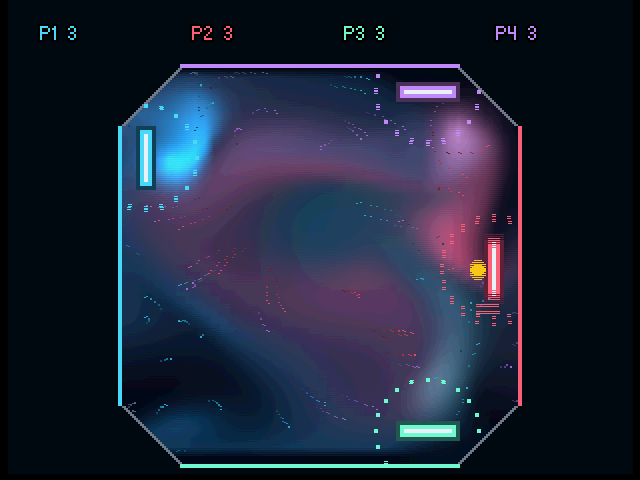

# Fluid performance development loop

The connected test system is an NTSC-J N64 and SummerCart64, currently firmware
2.20.2, with an 8 MiB Expansion Pak. The N64's physical power switch stays on.
Its ESPHome outlet URL is configured by `N64_POWER_URL`, entity `switch/switch`.
The user authorizes ROM uploads and explicit outlet on/off commands for development.
Use this interface instead of desktop automation to power the console.

## Bands-only smoothing and Relief removal, 2026-10-08

The user rejected Relief and preferred the original appearance of the other
views. The seven-effect selector now omits Relief, including its CPU and RSP
lighting code. Only Bands generates and displays the blurred texture; Dye,
Particles, Tails, Speed, Vortex and Pressure use their original colour texture.
The cached blit is rebuilt when its source texture changes, including switching
into/out of Bands without changing the court or menu dimensions.

Runtime IDs are now Bands=5 and Pressure=6. EEPROM PPH2–4 retains its existing
wire IDs (Bands=6, Pressure=7); the retired Relief ID 5 loads as NONE. Tests
cover all current choices and migration of older records without losing scores,
video settings or the FPS preference. Earlier all-eight-effect captures and
blurred non-Bands screenshots below are historical experiments.

`bands-only-no-relief-01` passed the portable suite and 4/8 MiB Ares numerical
and rendering fixtures, including the surviving dye/speed/Bands RSP producers.
A separate Options replay visited all seven IDs and wrapped to NONE without
RDP errors. The ordinary console run cycled every remaining effect with music
for 60 windows: **8.754 ms/update, 59.942 FPS, 8,990 frames / 8,990 VI**, zero
presentation misses and zero audio underrun observations. Power OFF was verified.
The shorter seven-effect cycle changes workload weighting relative to historical
eight-effect averages; this is not a matched simulation-speed comparison.
`just build` rebuilt the human-controlled `plasmapong.z64` with these defaults.

## Fluid display smoothing, 2026-10-08

`INK_SMOOTH=1` (default) applies a clamped 3x3 binomial blur to the colour
texture before ordinary screen scaling. Two half-texel-offset RDP box passes
use `FILTER_MEDIAN`, whose centre sample averages all four neighbours. Their
combined weights are `[1 2 1]` horizontally and vertically. A padded intermediate
sample preserves alignment and the outer borders. Upload strips include
neighbour rows and use 12 rows for RGBA32 input, 24 for RGBA16 input; cached
commands avoid repeating upload setup on the CPU.
The RSP producer, blur and final draw remain ordered on the normal queue, with
RDP pipe synchronization between render-to-texture passes. The simulation grid,
current strengths, ball sampling, particles and UI are unchanged. This reduces
cell/diagonal contrast at the cost of softer fine dye detail; it does not add
simulation resolution or completely eliminate the hardware's three-point filter.

`INK_SMOOTH=0` retains the unblurred display for comparison. The experimental
16-bit pixel producers require smoothing disabled; the retained RGBA32 producers
feed two RGBA16 blur targets to reduce RDP bandwidth. Added storage is 12,112 bytes
for the two 64x44-grid surfaces, plus the cached command block. Portable tests
check the reference filter against a scalar 3x3 calculation. Validation ROMs
compare actual RDP output against that reference at every pixel/channel with a
16-level bound for the two five-bit render-target quantizations, covering clamped
edges and strip boundaries.
Ordinary timing ROMs omit this fixture. The RGBA32 GPU trial
(`smooth-rdp-cached-04`) passed the two-level reference check but missed 21
presentations in Relief during its 60-window console capture, so it was replaced
by the lower-bandwidth targets. Its 10.124 ms/update average and 59.801 FPS are
not acceptance results. It had no audio underrun observations and verified OFF.

The initial CPU 2x-upscale trial (`smooth-candidate-01`) softened diagonal
creases but measured only 42.719 FPS with 601 presentation misses over 1,493
frames. The CPU 3x3 trial (`smooth-blur-02`) measured 51.868 FPS with 1,399 misses
over 8,992 frames. Both are rejected; their source archives remain in the ignored
experiment directories. Both had zero audio underrun observations and verified
power OFF. These are different-duration captures, not matched simulation timings.

The first RGBA16 trial (`smooth-rdp16-05`) reduced the problem to one missed
presentation in Relief, with no audio underruns. The retained implementation
(`smooth-rdp-packed-06`) uses wider upload strips and a tightly packed final
RGBA16 surface, reducing redundant uploads and enabling full-width LoadBlock.
Both 4/8 MiB Ares rendering checks passed, including the blur reference fixture.
Portable checks passed; an additional replay exercised low/high/low/high video
switches through Options. `just build` rebuilt the normal human-controlled ROM.

Matched ordinary 60-window console runs, four players, all eight effects and music:

| Run | Simulation ms/update | FPS | Frames / VI | Misses | Audio underrun observations |
| --- | ---: | ---: | ---: | ---: | ---: |
| `smooth-baseline-02` | 8.527 | 59.942 | 8,990 / 8,990 | 0 | 0 |
| `smooth-rdp-packed-06` | 8.529 | 59.937 | 8,990 / 8,990 | 0 | 0 |

Both captures ended with verified power OFF. The approximately 0.002 ms simulation
mean difference is negligible in these captures; this does not mean the blur is
free or establish unused RDP headroom. The final loop manifest covers the build
and emulator checks; its subsequent `hardware.log`/`hardware.json` retain the
ordinary console capture and matching ROM hash. No profiling is enabled.

Native Ares comparison uses the same four-player Bands replay at video field
900, with no boot fixtures. Images are unedited native output; static images
show edge softness, not motion quality.

| Before | GPU blur |
| --- | --- |
|  |  |

## Swirl fidelity acceptance, 2026-10-08

The user clarified that **7 ms/update is a stretch goal, not an acceptance
requirement**. Small simulation costs are acceptable for more swirly flow when
the complete game sustains the NTSC console's approximately 59.94 FPS cadence,
with no steady-state presentation misses or audio underruns. Simulation time
alone is not the frame budget: rendering, RDP completion and streamed audio must
also fit. Continue using ordinary matched hardware captures and an all-eight-
effects stress run for acceptance; Ares supplies correctness and native images.

## Dye visibility comparison, 2026-10-08

The accepted swirl implementation was committed as `fae1e83` before this trial.
The accepted change doubles `JET_DYE` from 6.4 to 12.8 in both the ROM build
and portable defaults. Jet radius, force, damping, confinement and dye decay are
unchanged. It increases the pigment injected by all players' ordinary jets;
ball trails, movement splats and release bursts retain their existing doses.

`dye-double-01` passed portable gameplay checks and 4/8 MiB Ares validation, then
captured the exact ordinary tails ROM at native video fields 900 and 1800. The
committed comparison images use the same input replay and fields from
`swirl-banded-03`. Brighter dye makes the transported curls easier to see, with
some whitening near the strongest overlapping jets. Images are unedited native
Ares output. The normal human-controlled ROM was rebuilt for this comparison.

The `dye-double-effects-01` ordinary console run exercised all eight effects
with music over 60 windows: **8.525 ms/update**, **59.943 FPS**,
**8,990 frames / 8,990 VI**, zero presentation misses and zero audio
underrun observations. It ended with verified power OFF. The user accepted the
brighter dye as the new default after comparing it with `fae1e83`.

| Ares video field | Committed dye (6.4) | Double dye (12.8) |
| --- | --- | --- |
| 900 |  |  |
| 1800 |  |  |

## Swirl restoration experiments, 2026-10-08

The first full-rate prototype retained 64x44 upwind transport, one warm pressure sweep,
fractional Q4 velocity and bilinear ball sampling, and added:

- `FLOW_CONFINEMENT=.75f`: restored fixed-point curl/confinement, chained on the
  RSP between velocity advection and projection. CPU and RSP use the same model;
  velocity remains bounded and wall-normal constraints are applied by projection.
- `FLOW_DAMPING=.12f`, reduced from `.16f`, for longer-lived currents.
- `JET_RADIUS=14` instead of 22 pixels, and `JET_FORCE=1800.0f` instead of 1500.
  The first narrower-jet trial at strength 1500 left only 17.3–17.4 px/s after
  release and failed the existing 18–24 px/s residual-current test. Strength
  1800 passes that unchanged test; its thresholds were not relaxed.
- `JET_DYE=6.4f` instead of 2.6: approximately preserves total pigment injection
  when narrowing the circular footprint. This corrects the first prototype's
  darker image without increasing its velocity. Suction and release bursts retain
  their existing footprints and forces.

The restored confinement source comes from `fae1d7b`, with its 64-field fixed/
float tests and 64 CPU/RSP/cache comparisons. `swirl-pigment-02` passed portable
checks, including 120-second gameplay stability, and 4/8 MiB Ares validation:
96 transport fields, 96 gradient fields, 148 pressure fields, the confinement
fixtures, 32 full velocity-pipeline comparisons, and rendering fixtures. Exact
fixtures run only in validation ROMs, not ordinary console timing captures.

Matched ordinary four-player high-resolution tails with streamed music:

| ROM | Simulation ms/update | FPS | Presentation | Audio underrun observations |
| --- | ---: | ---: | --- | ---: |
| `swirl-baseline-01` | 8.519 | 59.944 | 1,490 / 1,490 VI, zero misses | 0 |
| `swirl-pigment-02` | 9.355 | 59.943 | 1,490 / 1,490 VI, zero misses | 0 |

The combined tuning costs 0.837 ms/update (9.8%) in this matched workload; this
is not an isolated timing of confinement. Both captures ended with verified
power OFF. The baseline's successful log is `hardware-powered`; its original
loop failed to find the serial endpoint. The connected device was discovered at
its FTDI endpoint. An overlapping preliminary capture (`swirl-candidate-01` /
`swirl-effects-01`) was interrupted and is excluded from performance acceptance.
The final captures run serially, retaining their ROM hashes and power metadata.

The full-rate prototype failed the subsequent all-effects hardware budget:
`swirl-effects-02` presented 8,990 frames over 9,112 VI (122 misses), with zero
audio underrun observations. The misses occurred in Relief and its transition;
the 11.013 ms/update overall average is not comparable with the tails average.
Power OFF was verified. This candidate is not accepted for production.

`swirl-banded-03` distributes confinement over four contiguous row bands,
restoring one band per update at four times the per-update strength. Curl,
advection, projection, dye and ball sampling continue every update; each band
receives restoration every four updates. It is deterministic from the existing
velocity rounding phase and does not depend on the selected visual effect.
Portable checks (trace `e21bce90`) and all 4/8 MiB Ares fixtures passed, including
32 full-state comparisons against CPU band forces covering all four phases.
Matched tails measured **8.806 ms/update, 59.943 FPS**, 1,490 frames over 1,490 VI,
zero misses and zero audio underrun observations, ending with verified power OFF.
This is 0.288 ms/update (3.4%) above the fresh baseline and 0.549 ms below the
full-rate prototype.

The final `swirl-banded-effects-03` ordinary console capture exercised all eight
effects with streamed music for 60 measurement windows: **8.527 ms/update mean**
(8.089–8.959 ms across windows), **59.943 FPS**, **8,990 frames / 8,990 VI**, zero
presentation misses and zero audio underrun observations. It ended with verified
power OFF. Its manifest covers the emulator-only build/validation; `hardware.log`
and `hardware.json` retain the subsequent serial hardware capture and matching
ROM hash. This meets the user's 60 FPS acceptance workload. The accepted defaults
are `.75f` confinement spread across four bands, `.12f` damping, radius 14, force
1800 and dye 6.4. `just build` rebuilt the normal human-controlled `plasmapong.z64`
with these settings. Earlier full-rate and overlapping captures are not acceptance
evidence. No performance claim subtracts draw submission time from a frame budget.

Native Ares screenshots use the ordinary retained baseline and `swirl-banded-03` tails ROMs, the same scripted
input and video fields 900 and 1800. These are unedited emulator output, not
portable previews or desktop screenshots. Different ball trajectories are an
expected consequence of changed currents. The images show altered, more defined
streams and curls; still images do not establish motion quality or parity with
the 96x96 browser simulation.

| Ares video field | Before | After |
| --- | --- | --- |
| 900 |  |  |
| 1800 |  |  |

## Earlier performance goal, 2026-10-08

The user has requested a new optimisation pass after adding streamed music,
fixing input bugs and adopting the larger grid. Target **<=7 ms per simulation
update at the genuine 64x44 production grid**, keeping the current music/audio,
bounded fractional currents, smooth dye transport and predictable ball coupling.
Validate ordinary four-player stress captures across all eight effects at roughly
59.94 FPS with no steady-state presentation misses or audio underruns. Use a fresh
baseline from the current revision; earlier pre-music captures are historical
comparisons. Separate profiling captures from acceptance timing.

The previous <=6 ms goal below was paused before this new goal was requested.
It is retained as historical context, not the current acceptance threshold.

Fresh captures after USB reconnection: `music-baseline-7ms-01` measured
**9.337 ms/update, 59.942 FPS**, with 1,490 frames over 1,490 VI, zero misses
and zero audio underrun observations. Its portable checks and 4/8 MiB Ares
kernel fixtures passed. Hardware profiling (`music-profile-7ms-01`) substantially
perturbs scheduling: approximately 6.69 ms combined velocity/projection,
2.24 ms dye, 2.30 ms splats/pumps, and 0.47 ms sampling in its final window.
The profile's 12.19 ms total and 12 misses are diagnostic, not acceptance timing.

`upwind-weight-7ms-01` pre-scales the advection timestep so the RSP accumulator
produces rounded weights directly, removing three vector instructions per
coefficient without changing the integer result. All 4/8 MiB Ares kernel
fixtures passed. Ordinary hardware retry measured **9.127 ms/update, 59.943 FPS**,
1,490 frames over 1,490 VI, zero misses and zero audio underrun observations.
This is a 0.210 ms (2.2%) reduction in the matched tails workload, not attainment
of the 7 ms target or an all-effects result. Both ordinary captures ended with
verified power OFF; retained logs are `hardware-reconnected` and `hardware-retry`
in their respective experiment directories.

`upwind-unroll-7ms-01` expands the two velocity / three dye channel updates
and preloads split decay constants. It removes repeated scalar channel setup
and handles decay=1 exactly without a special inner-loop branch. The 4/8 MiB
exact kernel fixtures passed. Its matched ordinary tails capture measured
**8.879 ms/update, 59.943 FPS**, 1,490 frames over 1,490 VI, zero misses and
zero audio underrun observations. This is another 0.248 ms improvement (4.9%
total versus the fresh 9.337 ms baseline). Power OFF was verified. The current
7 ms target and all-effects acceptance remain unfulfilled.

The subsequent `upwind-unroll-effects-01` ordinary capture exercised all eight
effects with streamed music: **8.622 ms/update mean** (8.180–9.149 ms across
60 windows), **59.942 FPS**, 8,990 frames over 8,990 VI, zero misses and zero
audio underrun observations. It ended with verified power OFF. This establishes
current all-effects presentation stability; simulation cost still exceeds 7 ms.

`suction-weight-7ms-01` folds
radius-35 suction falloff into a 712-byte reciprocal-direction table. Other
radii and outward pumps retain the general calculation. Positions remain Q4,
velocity remains Q4, and dye/ball sampling is unchanged. The new portable test
compares 128 subpixel/edge/timestep cases against the continuous softened radial
field, with a maximum error of one Q4 velocity unit; sustained direction/bounds
and full gameplay checks also pass. Ares 4/8 MiB and exact-ROM playback passed.
The matched ordinary hardware capture measured **8.733 ms/update**, 1,490 frames
over 1,490 VI, zero misses and zero audio underrun observations, then verified
power OFF. This is another 0.146 ms saved, about 6.5% total versus the fresh
baseline. The earlier all-effects result predates this suction change; repeat
all-effects acceptance after further optimisation. The <=7 ms goal remains open.

`pressure-compact-warm-01` reads the existing Q3 short-pressure field directly
for the chained solve instead of reloading and repacking its Q12 mirror. The
compact pressure API now treats the short field as the warm input/output; both
fields must be initialized consistently. The standalone Q12 oracle interface
still accepts arbitrary warm words. Its matched hardware capture measured
**8.558 ms/update**, with 1,490 frames over 1,490 VI and zero audio underruns.

`pressure-vector-pack-01` then replaces scalar Q3-to-Q12 expansion with vector
multiply/high-low stores, preserving every output bit. Matched hardware measured
**8.483 ms/update** (8.366–8.609 ms across ten windows), 1,490 frames over
1,490 VI and zero audio underrun observations. Both runs passed the 4/8 MiB
exact fixtures, including 148 standalone pressure fields, dual pressure-output
comparisons and 32 full velocity-pipeline comparisons. Both ended with verified
power OFF. These pressure changes save 0.251 ms combined, bringing the matched
reduction versus 9.337 ms to approximately 9.2%; final all-effects acceptance
and the <=7 ms target are still pending.

Two subsequent experiments were rejected and their implementation removed:

- `force-batch-02` queued the original exact CPU-prepared splat footprints,
  transferred field ownership once per stage and applied all splats in order.
  Thirty-two new exact batch fixtures passed in 4/8 MiB Ares, covering overlap,
  both banks, capacity rollover, fallback and reads during a batch. Ordinary
  hardware regressed to **9.835 ms/update**, so batching by itself does not pay
  for the added RSP field transfers and work. Its source archive remains in the
  ignored experiment directory; the production force path remains on the CPU.
- `force-outline-01` prevented cloning/inlining of the two CPU force APIs.
  It shrank `game_step` from 24,204 to 22,468 bytes but measured **8.520 ms**,
  compared with the retained **8.483 ms**. Reduced code size did not yield a
  measured improvement, so the compiler boundary change was removed.

Both rejected captures presented 1,490 frames over 1,490 VI with zero audio
underrun observations and ended with verified power OFF. Their negative results
change the next approach: further offloading needs to reuse solver-resident
fields or reduce the algorithm's work, rather than add separate field passes.

Before committing this checkpoint, a local pressure-correction prototype was
removed after portable gameplay checks rejected it. The stateless version
reduced four-second residual jet speed to about 8.4 px/s; retaining pressure
history raised it only to about 10.0–10.4 px/s, outside the existing 18–24 px/s
expectation. The tests were not relaxed. No hardware acceptance result is claimed
for that prototype; its source is archived in ignored build evidence.

This committed checkpoint retains the measured **8.483 ms** warm-pressure solver,
the suction lookup, transport-loop improvements and optional SummerCart reload
support. The <=7 ms objective is still unmet; later all-effects acceptance must
use the final retained source rather than the earlier unroll-only capture.

## Retained checkpoint, 2026-10-08

At this checkpoint, optimisation was paused at the user's request. The official finer grid runs
near 60 FPS on the NTSC-J console; the original goals of 5 ms at 48x33 and
6 ms at 64x44 remain unmet. Historical experiment notes below describe progress
at the time of each capture, not additional work currently in progress.

`just build` now produces the official, human-controlled `plasmapong.z64` using
the retained configuration, without profiling or scripted input. `just deploy`
and `just emulate` use it too. Objects live in `build/official64` to keep them
separate from previous builds. There is one production solver: integer forces,
streaming upwind transport with inline limiting and prefetching, warm compact
pressure, and a chained RSP velocity pipeline. The old float/interpolation/Q12
solvers, unused confinement overlay, legacy preset and alternate-build aliases
have been removed. Retrieve historical implementations from Git rather than
selecting a legacy build. Portable checks and previews use the same defaults.
The remaining solver parameters are `GRID_W=64 GRID_H=44 CELL_Q4=72`,
`PRESSURE_PASSES=1` and `FLOW_DAMPING=.16f`. Historical flag combinations below
are records of earlier experiments, not current build instructions.

| Ordinary console capture | Grid | Mean simulation update | FPS | Presentation misses | Audio underrun observations |
| --- | --- | ---: | ---: | ---: | ---: |
| `baseline-20261008` (original, tails) | 48x33 | 10.000 ms | 59.941 | 0 | 0 |
| `grid48-inline-limit-01` (tails) | 48x33 | 5.821 ms | 59.953 | 0 | 0 |
| `grid64-inline-limit-01` (tails) | 64x44 | 9.521 ms | 59.945 | 0 | 0 |
| `grid64-inline-effects-01` (all eight effects) | 64x44 | 10.735 ms | 59.873 | 11 | 0 |

The tails captures each presented 1,490 new frames over 1,490 refreshes. The
all-effects capture presented 8,990 frames over 9,001 refreshes; its log confirms
effects 0 through 7. All captures ended with verified console power OFF.
64x44 contains 78% more cells than 48x33. Its tails update costs slightly less
than the original smaller grid, while the optimised 48x33 costs about 42% less.
Do not compare the all-effects average directly with tails to attribute a kernel
speedup: rendering and overlap differ. These are measured workloads, not a
promise of a perfectly locked frame rate in every scene.

Fractional velocity, smooth ball sampling, dye transport and wall constraints
remain. One warm pressure sweep, stronger damping and disabled confinement are
intentional approximations; they alter swirl detail. Portable gameplay tests and
Ares 4/8 MiB numerical fixtures passed, including 96 exact upwind fields and
32 full velocity-pipeline state comparisons on each grid. Native Ares images
support visual inspection; comprehensive visual acceptance remains manual.
Local evidence and immutable ROMs are retained under `build/dev-loop/` and are
not committed. Source, fixtures, build settings and this result summary are.

## Single-solver cleanup validation, 2026-10-08

`official-solver-cleanup-01` validates removal of the retired float/storage
variants, full-grid interpolation overlay, exact Q12 pressure implementation,
confinement overlay, standalone limiter scan and obsolete trace/gradient commands.
The CPU implementation of the current solver remains as the RSP oracle.
Portable checks now exercise that model by default, including a 120-second
full-game trace matching the pre-cleanup official result (`9d513a8b`).

Both 4/8 MiB Ares runs passed 96 upwind fields, 96 compact-gradient fields,
148 pressure fields, 32 full velocity-pipeline comparisons, and the pixel/divergence
fixtures. The ordinary matched four-player tails console capture measured
**9.489 ms/update, 59.944 FPS, 1,490 new frames over 1,490 VI, zero presentation
misses and zero audio underrun observations**. Power OFF was verified after capture.
This is a cleanup regression check, not evidence of a meaningful speedup over
9.521 ms. The earlier all-effects limitation remains documented above.

## FPS meter

**Options → FPS Meter** enables the overlay and controller-port-1 shortcuts:
**L** shows/hides it and **R** resets its counters. The setting saves to EEPROM
and defaults to OFF, including when loading older saves. With it OFF, L and R
have no effect. Presentation sampling continues for benchmark logs.

## SummerCart development reload

`just build-reload` builds a human-controlled `plasmapong-reload.z64` with
`USB_LOG=1 SC64_RELOAD=1`. Ordinary production and timing builds omit the handler.
For a retained experiment use `--define SC64_RELOAD=1` with `just dev-loop`.
The handler polls at frame boundaries, responds to Ping, drains RSP/RDP work
and stops audio/DMA before acknowledging Halt, then waits in RAM. Reboot loads
the newly uploaded ROM's IPL3 and enters the pinned libdragon warm-boot path.
This implementation targets ROMs built with this project's pinned toolchain.

First boot a reload-capable ROM with the normal power-off/upload/listen/power-on
workflow. With that ROM running, stop the debugger (one USB client at a time),
then use:

```sh
sc64deployer upload --direct --reboot plasmapong-reload.z64
sc64deployer debug --no-writeback
```

The deployer selects the connected device automatically; `sc64deployer list`
shows its endpoint. On this setup its libftdi backend can claim the device and
remove `/dev/ttyUSB0`; use the reported `ftdi://...` endpoint with the development
loop's `--port` option in that case. Firmware and outlet configuration stay unchanged.

`--reboot` requires support in the **currently running** ROM. Deployer 2.20.2
only warns on missing acknowledgements and continues uploading, so do not use
it to replace an older running ROM without the handler. Recover from a failed
reload with verified `just n64-power off` and the standard cold-upload workflow.
`sc64deployer reset` alone resets cartridge state, not the N64 CPU.

`sc64-reload-03` passed 4/8 MiB Ares gameplay validation and an actual cold boot →
halt/upload/reboot → gameplay capture on the NTSC-J console. Both AUX messages
were acknowledged. The first warm capture presented 290 frames over 290 VI with
zero misses; audio recorded one startup underrun observation and zero in the
following window. A second reload after eight seconds without a debugger also
acknowledged both messages and completed ten gameplay windows: 1,490 frames
over 1,490 VI, zero misses, and zero audio underrun observations in every window.
Both tests ended with verified console power OFF. Reload captures are workflow
validation, separate from ordinary
performance acceptance measurements.

Protocol reference: [SummerCart AUX registers and messages](https://github.com/Polprzewodnikowy/SummerCart64/blob/main/docs/01_memory_map.md).

## Run an experiment

Copy `.env.example` to `.env` and set `N64_POWER_URL` to your outlet URL.
The tools read this file automatically; an exported environment variable takes
precedence. `.env` is ignored by Git. Keep local outlet addresses out of tracked
source and documentation. `--power-url` (or `--url` on the power tool) overrides
the configured value. Emulator-only runs do not require an outlet setting.

```sh
just dev-loop baseline-20261008
just dev-loop integer-forces --define YOUR_IMPLEMENTED_FLAG=1
just dev-loop candidate-stages --profile
just dev-loop candidate-effects --workload effects --windows 60
just n64-power status
just n64-power on
just n64-power off
```

The example `YOUR_IMPLEMENTED_FLAG` is a placeholder: implement a candidate build
flag before using it. Every experiment name must be new. Candidate settings use
repeated `--define KEY=VALUE` arguments. `--skip-check` is available only when the
current source already passed portable checks. `--emulator-only` omits console
upload and power control. Python entry points work without `just`:
`python3 tools/dev-loop.py NAME` and `python3 tools/n64_power.py status`.

The loop runs portable gameplay/numerical tests, builds a separate RDP-validation
ROM, and runs scripted gameplay in Ares with both 8 MiB and 4 MiB memory. It then
builds the benchmark ROM, retains a copy, runs that exact ROM in Ares, and measures
it on the console. Default workload is continuous four-player jets/suction in
high-resolution tails mode. `--workload 2p`, `menu`, and `effects` select other
deterministic scenarios. Effects cycle every 15 simulated seconds: use enough
windows to cover the full cycle (60 windows at full speed).
Use `--kernel-checks` for exact RSP numerical fixtures in the validation ROMs.
They stay out of the ordinary benchmark ROM so their large static buffers do
not change its framebuffer placement or memory footprint.

Inputs come from `tests/rom_smoke.h` inside the test ROM, including actual menu
navigation, so neither emulator nor console requires desktop key injection.
Do not use X11/KDE input automation. Interactive visual QA can use Ares's own
controls and native Capture Screenshot command. The existing runner's optional
X11 screenshot path is not used by this loop. There is no automated visual
acceptance or console video capture in this setup yet. Native Ares frame capture
is available through the adapter below, without desktop screenshot automation.

## Hardware sequencing

1. Confirm outlet state, send `turn_off`, verify OFF, wait two seconds.
2. Upload to SummerCart RAM with direct boot; no SD menu selection is needed.
3. Start the USB debugger before turning power on so startup messages are captured.
4. Send `turn_on`, verify ON, capture timing/presentation/audio windows.
5. Stop the debugger and turn power OFF. Capture failures also attempt power-off.

`tools/benchmark-hardware.py --upload --power-control` provides the
same sequencing for an existing ROM. The explicit serial port is
`serial:///dev/ttyUSB0`; change `--port` if device enumeration changes.
RAM upload selects direct boot on the cartridge. `just deploy` remains the separate
SD-card deployment workflow and requires power OFF. The automated loop normally
leaves the console off; `--leave-on` on the hardware capture tool leaves it running
after success. Network, Docker, USB and Ares display access may require sandbox
escalation; use the authorized tool paths, without changing desktop permissions.

## Evidence and decisions

Each run retains `build/dev-loop/NAME/`: source revision/status/hashes, tracked
source patch, complete non-ignored source archive (including untracked prototypes),
build settings/commands, build logs, validation and exact-ROM Ares
logs, the uploaded ROM and SHA-256, and raw hardware USB logs plus JSON summaries.
An incomplete run records failure in `manifest.json`; reuse neither its name nor
its capture files. Validation and profiling ROMs are separate from the ordinary
hardware benchmark because instrumentation changes scheduling and execution cost.
Ares timings are useful for regression checks; console measurements decide speed.

Prioritize simulation milliseconds and completed-frame headroom, not just FPS:
FPS is capped at about 59.94 on this console. Check presentation repeats, maximum
VI gap and audio underruns as well. High resolution is 640x480 interlaced with a
new framebuffer each NTSC field, not 60 complete two-field scans per second.

The aim is affordable, believable currents with predictable ball response,
leaving room for features and a finer fluid grid. Approximate candidates need not
match the old solver bit for bit. They must stay bounded, preserve smooth ball
sampling, maintain visible transport in the same direction as ball forces, and
avoid persistent wall leaks, quantization sticking, or unstable jets/suction.
Use current portable interaction tests plus deterministic visual/playback checks;
adapt exact-oracle tests deliberately when changing the numerical method.

Compare one change at a time against the same workload/settings. First measure
force kernels, flow sampling and pressure solver alternatives at 48x33; then
spend demonstrated headroom on higher resolution. Shared CPU/RSP parameters now
support 48x33 at six-pixel cells and 64x44 at four-and-a-half-pixel cells, keeping
the same 288x198 physical arena. The wider grid requires `UPWIND=1 PRESSURE_Q3=1`;
whole-grid 16-bit advection does not fit RSP memory there. Unsupported combinations
fail at build time instead of silently using mismatched layouts.

## Initial console control, 2026-10-08

The first automatic capture, `build/dev-loop/baseline-hardware.json`, recorded
59.9409 FPS, 9.9919 ms/update across nine simulation windows, 2.2229 ms draw
submission across ten rendering windows, 1,490 new PLAY frames / 1,490 VI, and no
repeats or audio underruns. It used the shipping 48x33 grid and scripted 4P stress.
Draw submission is not standalone RDP execution time and cannot establish all
remaining frame headroom by subtraction. The subsequent named complete-loop run
retains build/source provenance and separate 4/8 MiB validation.

## Active fidelity/performance goal and first experiments

Target: genuine 64x44 fluid at <=6 ms/update, maintaining 59.94 FPS in 4P stress
across all effects, bounded forces, smooth dye/ball response and no steady-state
presentation misses or audio underruns. The intermediate target is <=5 ms/update
on 48x33. No budget reduction has been demonstrated sufficient for 64x44 yet.

Matched 48x33 four-player tails hardware captures:

| Experiment under `build/dev-loop/` | Mean update | FPS | Misses | Interpretation |
| --- | ---: | ---: | ---: | --- |
| `baseline-20261008` | 10.000 ms | 59.941 | 0 | Shipping control |
| `integer-forces-02` | 9.359 ms | 59.942 | 0 | Integer radial kernels; gameplay/arcade checks pass |
| `pressure-four-01` | 8.237 ms | 59.945 | 0 | Integer forces + four pressure passes; lingering-current behavior changes |
| `local-advection-01` | 14.296 ms | 57.483 | 63 | Exact vector neighbourhood experiment rejected for cost |
| `coherent-advection-01` | 14.127 ms | 59.925 | 0 | Simpler exact vector case also rejected for cost |

All listed hardware captures reported zero audio underrun observations. Profiling
is absent from these ordinary benchmark ROMs. The vector experiments passed exact
RSP fixtures in Ares with both memory sizes but did not improve console update
cost; their source changes remain recoverable from the ignored run patches and
are removed from the candidate implementation.

`FORCE_FIXED=1` enables experimental integer splat/pump loops, leaving coefficient
conversion at API boundaries. Positions retain 1/16-pixel precision. The pump
uses a generated reciprocal-length table with finer spacing near its centre.
600 randomized comparisons show mean velocity error 0.003362 px/s and maximum
single-injection error 3.0 px/s; dye error is <=0.002930. Direction, saturation,
non-emitting suction and 120-second gameplay/arcade checks pass.

`PRESSURE_PASSES=4` or `6` selects a smaller CPU/RSP wavefront; default remains 8.
Four passes pass 128 CPU/RSP differential fields with DMA guards in Ares and on
console. The existing lingering-jet band deliberately remains unchanged: after
three seconds of jets and four seconds of decay, the integer-force eight-pass
control retains about 18.8-19.0 px/s RMS flow, six passes 17.0-17.6, and four passes
14.1-14.6. The lower-pass variants fail that control's 18-24 px/s band and are not
promoted. This is a measured gameplay-quality tradeoff, not a numerical crash.
At this stage, performance candidates remained opt-in pending broader checks.

## Genuine 64x44 prototype and compact projection, 2026-10-08

`GRID_W=64 GRID_H=44 UPWIND=1 PRESSURE_Q3=1 FORCE_FIXED=1` selects the wider
simulation. Every velocity/dye cell, divergence, pressure, curl, force footprint,
sample and visual producer uses that grid. It is not a higher-resolution texture
over the 48x33 physics. Runtime USB logs report its 2,816 cells and cell Q4 size 72.

The local upwind transport limits combined velocity to a stable cell displacement,
preserving fractional Q4 velocity. The limiter modifies the same field read by
the ball and dye; it never caps only the visible transport. Two/three channels
share coefficients and stream through three cached rows on the RSP. CPU/RSP
fixtures compare 96 velocity/dye cases, including all directions, zero/unity
decay, extreme timesteps, source ownership and DMA guards. World-space gameplay,
arcade, multiplayer and frame-rate tests also run on the 64x44 CPU model.

Compact Q3 pressure approximates the serial left-neighbour recurrence with four
parallel terms and a 1/256 tail. Public Q12 pressure remains available for the
existing visual modes. `PRESSURE_FAST_GRADIENT=1` adds a Q3 pressure output for
a separate vector gradient overlay, avoiding 32-bit lane gathers. Its reciprocal
error is at most one Q4 velocity unit (1/16 pixel/s), including extreme pressures.
96 fixtures check that bound, dual-output equivalence, walls and cache/DMA guards.
The exact 32-bit gradient path remains available and checked independently.

All wider-grid numeric/render fixtures pass in Ares with 8 and 4 MiB. The tests
also exposed and corrected fixed-width wall/plane offsets, a shortened gradient
prefetch missing its last lane, and a menu stamp cache that was too small.
Gameplay transport probes preserve physical positions across grids. The release
linearity probe explicitly checks that its samples are below the nonlinear CFL
cap, and the trail test checks the translated profile instead of a dose threshold
specific to six-pixel cells. These preserve the tested mechanics, not looser
arbitrary tolerances.

| Hardware experiment | Grid | Mean update | Render FPS | Outcome |
| --- | --- | ---: | ---: | --- |
| `pressure-q3-01` | 48x33 | 9.679 ms | 59.942 | Smaller storage, not faster than integer-force control |
| `upwind-q3-01` | 48x33 | 9.570 ms | 59.943 | Stable capture; streaming layout enables the wider grid |
| `grid64-q3-02` | 64x44 | 15.913 ms | 16.591 | Genuine finer simulation, too costly; misses and underruns |
| `grid64-short-gradient-01` | 64x44 | 15.611 ms | 23.511 | Partial cost reduction; misses/underruns remain |

The <=6 ms / 59.94 FPS goal is not achieved. Wider-grid changes remain experimental.
The later reduced-confinement candidate below reduces 48x33 further to 5.955 ms/update.
No wider-grid candidate had been promoted at this stage; see the official checkpoint above.

The `grid64-short-profile-01` diagnostic reports approximately 2.71 ms velocity
advection, 1.65 ms curl/confinement, 5.11 ms chained projection, 2.80 ms dye
advection, 2.29 ms CPU splats/pumps, and 0.39 ms sampling. Nested upwind counters
attribute about 0.75/0.73 ms to CPU velocity/dye limiting and 1.94/2.04 ms to their
queued jobs. Those nested counters are subsets, not additional costs. Profile
overhead and queue effects mean these are diagnostic inclusive timings. The
next useful targets are the CFL scans, projection, and force/confinement work.

## Reused pressure and RSP limiting, 2026-10-08

`UPWIND_GPU_LIMIT=1` moves the shared velocity cap onto the RSP. Its integer
reciprocal model is checked across every supported magnitude, including diagonal
and axial bounds, and passes the 96 CPU/RSP advection fixtures. Hardware savings
are small because the RSP still needs another pass through velocity memory.

`PRESSURE_WARM_START=1` reuses the preceding pressure field instead of clearing it.
The CPU and RSP normalize boundary ghosts consistently and fixtures initialize
both solvers with the same pressure. Four sweeps with `FLOW_DAMPING=.12f`, and two
with `.16f`, pass the existing lingering-current/gameplay checks. Two sweeps with
`.24f` fail the lingering-current band and are rejected. These are experimental
tuning combinations, not shipping defaults.

| Hardware experiment (64x44, 4P tails) | Mean update | Render FPS | Misses | Audio underrun observations |
| --- | ---: | ---: | ---: | ---: |
| `grid64-gpu-limit-01` | 15.399 ms | 28.078 | 1700 | 587 |
| `grid64-warm4-01` | 14.841 ms | 40.644 | 711 | 67 |
| `grid64-warm2-01` | 14.535 ms | 47.390 | 396 | 0 |
| `grid64-confinement-window-01` | 14.493 ms | 48.388 | 357 | 0 |

The two-sweep run passed all portable checks and 4/8 MiB Ares numerical/render
fixtures. Its candidate CPU model also passed arcade, multiplayer and frame-rate
checks. Hardware recorded 1,491 new frames across 1,887 VI; zero audio underrun
observations does not compensate for its missed presentations. It is still far
from the 6 ms / 59.94 FPS goal. Pressure work alone is giving diminishing returns.

The confinement kernel now retains a rotating window of three curl rows. This
removes 78 row DMAs per update on 64x44 (9,984 bytes) without changing the
calculation. The 64 fixed-reference fields and 64 chained/cache fixtures pass
on both 48x33 and 64x44 with both Ares memory sizes. The matching ordinary
hardware ROM measured only
0.042 ms less per update than `grid64-warm2-01`; their timing ranges overlap, so
this single capture does not establish a reliable speedup. It remains far below
the reduction needed. Its hardware capture was run after the emulator-only loop
using the retained ROM and is stored beside that loop's manifest.

## Splat offload experiment rejected, 2026-10-08

The current two-sweep diagnostic (`grid64-warm2-profile-01`) attributes 3.613 ms
to velocity advection, 1.952 ms to curl/confinement, 2.994 ms to projection,
2.428 ms to dye advection, 1.151 ms to splats, 1.199 ms to pumps and 0.454 ms to
sampling. These include queue waits/cache work and are not isolated RSP execution
costs; the profile ROM is separate from the ordinary timing control.

`grid64-splat-rsp-01` kept CPU-computed integer radial weights and applied signed
velocity/dye updates with a new RSP overlay. It passed 96 exact RSP cases in both
Ares memory sizes, plus 800 host dispatch comparisons across both grids, including
footprint edges, palette selection, saturation and large-amplitude fallback.
However, its ordinary hardware capture regressed to **15.309 ms/update, 29.711
FPS, 1,525 missed presentations and 574 audio underrun observations**. Per-splat
synchronous dispatch does not improve this workload. The experiment was removed
from the working implementation; its complete added/modified source is retained
in `build/dev-loop/grid64-splat-rsp-01/rejected-splat-source.zip`, with the ROM,
logs and original build provenance. A future force offload needs batching and
ownership across the whole force stage to avoid these repeated synchronization
boundaries; this capture does not prove that batching would be faster.

New development-loop runs now retain `source.zip` as well as source hashes and
the tracked patch. Previously the patch omitted untracked prototypes, so hashes
alone could not reconstruct them after removal. Ignored local configuration and
build artifacts are excluded by the same Git file selection as the source hashes.

## Single-batch velocity pipeline, 2026-10-08

`VELOCITY_CHAIN=1` retains RSP ownership from the upwind limiter/advection through
curl, confinement, divergence, warm pressure and compact gradient. It removes the
CPU waits and redundant velocity cache writebacks between those stages. The final
wait returns both velocity banks and public diagnostic fields to the CPU. Dye
transport remains separate because gameplay applies suction after velocity solving.

Divergence can read zero wall normals virtually while the velocity field remains
RSP-owned; the final gradient writes the physical wall zeros. This avoids a CPU
wall edit between queued jobs. The extra divergence handling is compiled only for
the optional pipeline. Every overlay is registered before the first job is queued.
The flag requires the complete high-priority upwind/compact-projection backends.

32 full-state comparisons match the existing separately synchronized stages
exactly, including the old limited velocity bank, curl, divergence, pressure and
compact pressure. Both grids pass 4/8 MiB Ares validation. The 48x33 fixtures also
alternate ordinary/high-priority queues. Portable checks pass, and the two-sweep
`.16f` damping configuration passes the 48x33 120-second gameplay test as well as
the previously checked 64x44 model. These checks establish scheduling equivalence;
they do not establish all-effects visual acceptance.

| Ordinary hardware run, 4P tails | Grid | Mean update | Render FPS | Misses | Audio underrun observations |
| --- | --- | ---: | ---: | ---: | ---: |
| `grid48-velocity-chain-01` | 48x33 | 6.945 ms | 59.949 | 0 | 0 |
| `grid64-velocity-chain-01` | 64x44 | 13.878 ms | 57.590 | 60 | 0 |

Both use integer forces, Q3 pressure with two warm-started sweeps, `.16f` flow
damping, upwind transport with the RSP limiter, and compact gradients. At 64x44,
the matched unbatched control was 14.493 ms: about 4.2% less update time. The 48x33
result combines these solver changes with batching; its reduction from the
10.000 ms shipping control must not be attributed to batching alone. It recorded
1,490 new frames across 1,490 VI and zero audio debt in every captured window.
The 48x33 capture was appended to the emulator-only run using its retained ROM.
Neither the <=5 ms intermediate target nor the <=6 ms finer-grid target is met.
All candidates remained optional at this stage; see the paused checkpoint above.

## Removing swirl restoration, 2026-10-08

A branch-free equivalent for integer force rounding passed 1,200 complete-state
comparisons but measured 6.923 ms/update versus 6.945 ms for the control. Their
ranges overlap; no useful speedup was established. The original rounding code
was restored. `grid48-force-rounding-01/source.zip` retains the experiment.

`FLOW_CONFINEMENT=0.0f` now omits curl generation and vorticity confinement in
both the CPU model and the queued velocity pipeline. This removes a whole
restoration stage, rather than computing it with zero amplitude. Advection,
pressure, wall conditions, dye transport and ball sampling remain active on every
grid cell. Default confinement stays at 1.25. This is a visual/physical tradeoff:
small vortices receive less reinforcement, so matching the old flow is not claimed.

The two-sweep, `.16f` damping candidate passes 120-second gameplay checks on both
grids and 64x44 arcade, multiplayer and frame-rate checks. 4/8 MiB Ares fixtures
validate the RSP pipeline against the corresponding no-confinement model. The
48x33 ordinary hardware capture (`grid48-no-confinement-01`) measured **6.271
ms/update, 59.952 FPS, zero misses and zero audio underrun observations**, with
1,490 new frames across 1,490 VI. This remains above the 5 ms intermediate target.

The corresponding `grid64-no-confinement-01` run measured **12.924 ms/update,
59.928 rendered FPS, zero misses and zero audio underrun observations**. Its
presentation counters recorded 1,490 new frames across 1,490 VI and zero audio
debt. Thus the finer grid meets presentation cadence in this tails capture, but
its simulation time remains more than twice the 6 ms budget and all-effects
acceptance remains unverified. The goal is not complete.

Native field-900 comparisons are `native-confinement48-control-01.png` and
`native-no-confinement48-01.png` under `build/dev-loop/`. Both show curved dye
bands and tracer patterns; the shapes differ. The still images do not prove
motion quality or all-effects acceptance. Gameplay transport tests provide the
separate evidence for dye/ball coupling. A one-pressure-sweep CPU probe at this
same damping also passes the 48x33 gameplay test; its hardware performance is
not measured yet (`no-confinement-one-pass-game.log`).

## One sweep and asynchronous advection rows, 2026-10-08

One warm-started pressure sweep with `.16f` damping and zero confinement passes
120-second gameplay checks on both grids. It reduces 48x33 to **6.066 ms/update**
(`grid48-one-pass-01`), with zero presentation misses and audio underrun observations.

`UPWIND_PREFETCH=1` adds a fourth cached source row per advection channel. While
the current row computes from y-1/y/y+1, asynchronous DMA fetches y+2 into the
spare slot. Output rows also use asynchronous DMA. The next row explicitly waits
before consuming the prefetched data or reusing output storage, and the command
waits before returning ownership. This uses the pinned libdragon DMA API; it does
not change numerical results or omit cells. The ordinary three-row path remains
available. Both 4/8 MiB Ares runs pass the 96 exact advection fields and 32 complete
velocity-pipeline state comparisons on both grids.

| Ordinary 4P tails run | Grid | Mean update | FPS | Misses | Audio underrun observations |
| --- | --- | ---: | ---: | ---: | ---: |
| `grid48-one-pass-01` | 48x33 | 6.066 ms | 59.952 | 0 | 0 |
| `grid48-upwind-prefetch-01` | 48x33 | 5.955 ms | 59.953 | 0 | 0 |
| `grid64-one-pass-01` | 64x44 | 9.761 ms | 59.943 | 0 | 0 |
| `grid64-upwind-prefetch-01` | 64x44 | 9.650 ms | 59.944 | 0 | 0 |

The 48x33 control's timing windows span 6.024–6.118 ms; the prefetched candidate
spans 5.914–6.008 ms. The matched wider-grid control measured 9.761 ms without prefetching, so
prefetching accounts for about 0.111 ms there; most of the reduction from the
two-sweep capture accompanies the one-sweep configuration. Its 64x44 CPU model
also passed arcade, multiplayer and frame-rate checks.
Neither timing target is achieved, and these captures cover tails rather than
all effects. Candidates remain optional.

## Inline velocity limiting, 2026-10-08

`UPWIND_INLINE_LIMIT=1` clips velocity rows already loaded for advection, avoiding
the separate CFL scan. It preserves the reciprocal arithmetic and writes the
clipped source velocities back for ball sampling. Both initial rows and every
new below row are clipped before neighbour reads; dye coefficient rows are
clipped before weights are formed. The final DMA wait includes these writes.
The standalone limiter remains available as a control. Full-state Ares fixtures
on both grids verify output, source-bank ownership and dirty-cache handling.

The retained tails runs measure 5.821 ms at 48x33 and 9.521 ms at 64x44, compared
with 5.955 ms and 9.650 ms with prefetching alone. These are modest incremental
savings. The subsequent all-effects capture and remaining limitations are
recorded in the checkpoint table above. No further implementation is in progress.

## Native Ares screenshots

`python3 tools/build-ares-capture.py` reuses the existing Ares CMake build,
compiles a private Program translation unit and links
`build/ares-native-capture/ares`. It does not edit the Ares checkout or its build
outputs. A manifest records source revision/status, commands and binary hash.
The adapter sends its video callback directly to Ares's PNG encoder when the
runner requests a field. Its emulation core and controller input remain unchanged.

```sh
python3 tools/benchmark-ares.py ROM.z64 build/dev-loop/visual.log \
  --ares build/ares-native-capture/ares \
  --native-screenshot build/dev-loop/visual.png --native-frame 300 --windows 2
```

Capture files are not overwritten. If logging finishes before the requested
field, the runner waits on that same emulator process. The summary records PNG
dimensions and SHA-256. Use ordinary ROMs for captures: boot fixtures consume
video fields before gameplay. Native baseline and 64x44 comparison images are
`build/dev-loop/native-baseline-01.png` and `native-grid64-01.png`. They show actual
Ares frame output; the changed algorithm means they are not a resolution-only
comparison. Automated visual acceptance and console video capture remain absent.
