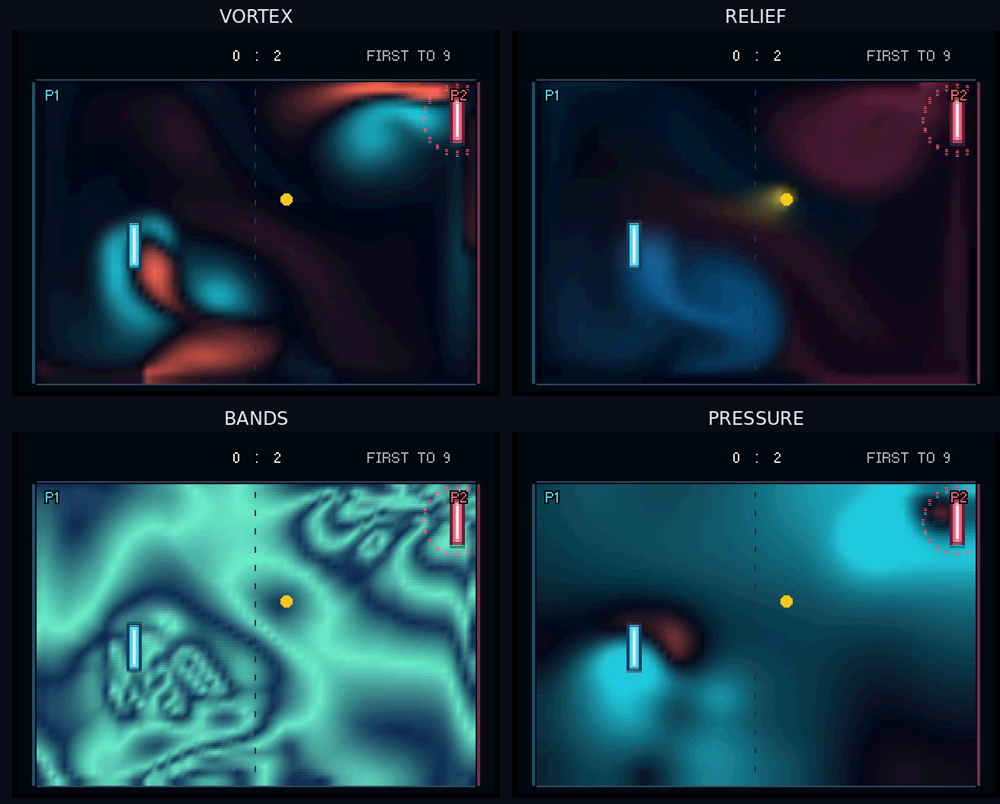

# Fluid visualisation prototypes — 2026-10-04

All four prototypes are in **Options → Flow Effect**, alongside NONE, PARTICLES,
PARTICLE TAILS and SPEED. The animated menu/Options background previews the
selection, and the existing EEPROM setting retains it across matches and restarts.
Existing effect IDs remain unchanged; the four new IDs are appended.

Screenshots refreshed in Ares on 2026-10-08 with the current solver and FPS
meter OFF. The experiment results below retain their original measurements.



The contact sheet removes only the Ares menu/status bars and resizes the game
image. Original window captures: [VORTEX](flow-views/vortex.png),
[RELIEF](flow-views/relief.png), [BANDS](flow-views/bands.png),
[PRESSURE](flow-views/pressure.png). These are low-resolution two-player scripted
ROM captures, with the same input timeline. Capture happens after the second
PLAY simulation timing window; the desktop capture itself is not locked to an
exact simulation tick. The FPS overlay is the game's real presentation counter.

## Appearance and implementation

| Effect / ID | What it reveals | Producer |
| --- | --- | --- |
| VORTEX / 4 | Cyan counterclockwise rotation and coral clockwise rotation, using screen coordinates with downward-positive y | CPU: differences of final projected velocity, cached signed palette |
| RELIEF / 5 | Directionally lit dye, with darker troughs and brighter edges; a subtle ink/satin appearance | CPU: summed dye density and bounded lighting stencil; RSP: existing dye conversion plus vector lighting |
| BANDS / 6 | Repeating navy/mint bands of approximate speed, exposing the shape of currents without requiring dye | Existing RSP speed kernel, alternate palette; strongest flow holds a bright plateau |
| PRESSURE / 7 | Cyan negative and coral positive regions of the projection solver's pressure | CPU: fixed-gain Q12 pressure mapping and cached signed palette |

Each produces the existing **48 × 33 RGBA32 texture** and uses the same cached,
bilinearly enlarged RDP drawing block. There are no extra screen passes,
particles, blur buffers, advection channels, square roots or per-cell
trigonometry. Palette exposure is fixed rather than frame-normalised. No fluid,
ball or gameplay state is written by these producers.

VORTEX recomputes curl because the confinement curl and projection divergence
share a scratch union. It uses the current projected velocity rather than an
obsolete confinement intermediate. PRESSURE displays solver pressure, not
physical water height; its sign follows the existing solver convention.
RELIEF approximates a fixed directional light, not a reconstructed 3D surface.
Lighting is quantised to match a cheap RSP multiply, with at most three channel
levels discarded before final clamping. Existing dye and SPEED colours are
unchanged. Portable float/fixed and experimental 16-bit paths have CPU fallbacks.

BANDS is the cheapest addition. VORTEX, RELIEF and PRESSURE consume more CPU
submission time, so their hardware acceptance remains outstanding even though
all meet the emulator cadence. None currently needs a 30 Hz compromise.

## Emulator acceptance

Matched benchmark ROMs use the default RSP backend and yielding scheduler,
**four-player 640 × 480 stress gameplay**, all jets/pumps active, USB logging,
and the **ordinary asynchronous renderer**. No stage profiler or completed-frame
fence is enabled. Each run contains ten complete 150-frame windows.

| Mode | Render cadence | Simulation / step | CPU draw submission / frame |
| --- | ---: | ---: | ---: |
| NONE (dye control) | 59.931 FPS | 9.032 ms | 0.909 ms |
| SPEED control | 59.931 FPS | 9.036 ms | 0.886 ms |
| VORTEX | 59.927 FPS | 9.039 ms | 2.895 ms |
| RELIEF | 59.927 FPS | 9.050 ms | 2.515 ms |
| BANDS | 59.931 FPS | 9.029 ms | 0.884 ms |
| PRESSURE | 59.929 FPS | 9.055 ms | 1.832 ms |

All six runs ended with **1,490 new PLAY frames / 1,490 VI**, zero repeats,
zero missed fields, and a maximum one-VI presentation gap. Every audio window
reported zero underrun observations and zero sample debt. Draw submission is
not completed RDP drawing time. These emulator timings do not establish console
performance.

Additional checks:

- Full portable suite, including Options wrap/navigation and saved settings.
- New float/fixed visual tests: curl sign, scratch independence, pressure sign,
  unchanged source state, texture boundaries, padding and opacity.
- Address/undefined sanitizers for fixed visual producers. Leak detection is
  disabled because the sandbox's tracing prevents LeakSanitizer from running.
- Ares: 80 exact RELIEF/BANDS CPU-versus-RSP fields, DMA/stride guards, source
  integrity, queued render consumers, and all existing preparation/gradient
  fixtures. These pass with both 4 MiB and 8 MiB RDRAM.
- RDP validation during four-player high-resolution gameplay, each
  two-player screenshot replay, and controller-driven navigation through all
  eight high-resolution Options previews. The cycle includes blocking EEPROM
  saves at every selection; its aggregate cadence is not a steady-effect
  performance measurement. Validation also adds substantial overhead.

The [Options PRESSURE preview](flow-views/options-pressure.png) shows the
existing selector and animated background. Its cumulative miss count includes
setting-save pauses and the instrumented cycle through previous modes.
A separate ordinary-renderer Options cycle also visited all eight modes without
RDP errors or observed audio underruns. Its 72 cumulative missed fields occurred
in windows containing the eight EEPROM saves; the save-free window retained
150 steps/150 frames at 16.683 ms/frame with no additional missed fields.
Changing an option still incurs the pre-existing blocking EEPROM save pause;
this prototype does not change storage behaviour.

The initial scalar RELIEF producer took about 4.56 ms for texture generation
and missed fields in an instrumented stress run. It was replaced with the
vector colour/lighting producer above; that rejected implementation is not the
playable prototype.

Raw ignored artifacts are in `build/views/`: `*-async.log` / `.json`,
`rsp-validate*`, `*-showcase*`, and earlier prototype diagnostics.

## Reproduce and test on hardware next

```sh
just check
just prototype-views               # human-controlled plasmapong-views.z64
just benchmark-view 4              # scripted plasmapong-view-vortex.z64
just showcase-view 4               # low-res 2P screenshot replay
just validate-views                # exact fixtures, then cycle all eight effects
just smoke-view-options            # navigate and preview all eight in Options
python3 tools/benchmark-ares.py plasmapong-view-vortex.z64 build/views/vortex-async.log --windows 10
python3 tools/benchmark-ares.py plasmapong-showcase-vortex.z64 build/views/vortex-showcase.log --windows 3 --screenshot build/views/vortex-showcase.png
```

`./tools/build-views.sh benchmark` builds all six matched stress ROMs; IDs are
0=dye, 3=SPEED, 4=VORTEX, 5=RELIEF, 6=BANDS, 7=PRESSURE. USB logging is enabled
for subsequent console captures. `plasmapong-views.z64` is the human-controlled
ROM containing the same new producers and existing Options selector.

For console acceptance, compare each scripted ROM against dye/SPEED with the
same high-resolution workload and scheduler. Check ten presentation/audio
windows, then manually inspect low/high-resolution gameplay and Options,
including pause/resume and cartridge settings persistence. Require target
cadence, no sustained presentation repeats/misses and no audio debt. No ROM has
been uploaded to the console as part of this prototype work.

## Returning to the main menu

The main menu, Options preview and court all pass the selected `FlowEffect`
through the same `flow_background`/`draw_fluid` path. The menu has no dye-only
fallback, including for SPEED. The cached menu foreground contains only labels
and title geometry; it does not freeze the fluid texture or selected view.

The controller-driven `just smoke-menu-view 7` test enters Options, selects
PRESSURE, presses B and holds on the actual main menu. `just smoke-menu-view 3`
exercises SPEED, which previously had the explicit menu-only dye fallback.
Both transitions pass in Ares with RDP validation enabled. Separate ordinary
renderer runs retained 150 steps/150 frames at approximately 16.683 ms/frame
in the two complete main-menu windows, with zero presentation misses/repeats.
The first timing window includes Options navigation and EEPROM save pauses.

Ordinary-renderer captures: [PRESSURE on the main menu](flow-views/main-menu-pressure.png)
and [SPEED on the main menu](flow-views/main-menu-speed.png).
